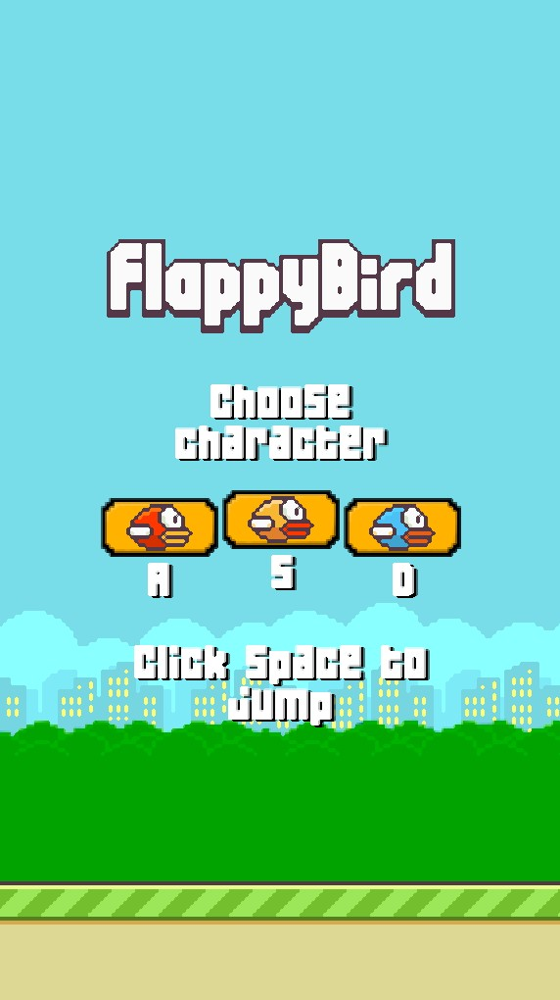
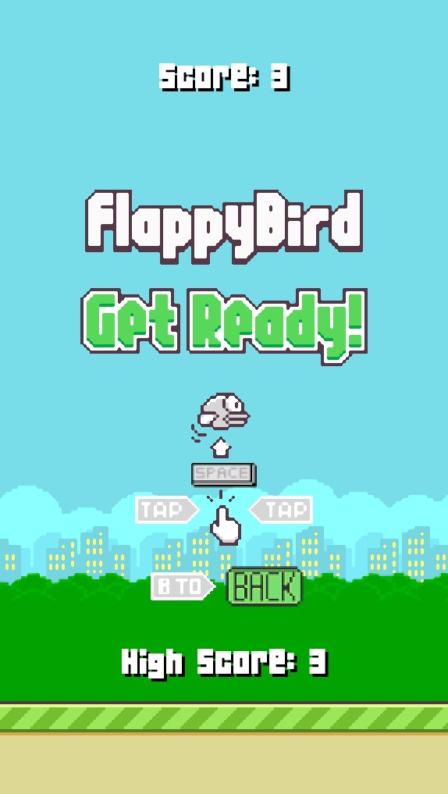
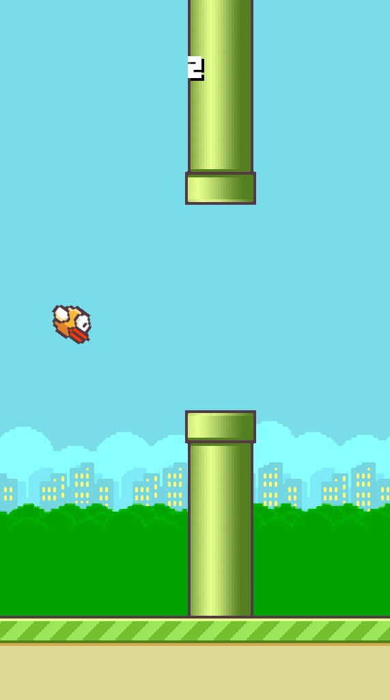

# FlappyBird
## Table of contents
* [General info](#general-info)
* [Technologies](#technologies)
* [Screenshots](#screenshots)

## General info
My first game.

Game made for friends and me

Assets - textures and images

Sound - sound effects of the game

Fonts - font

main.py - whole code of the game
	
## Technologies
Project is created with:
* Python
* pygame
* assets from web

## Screenshots

